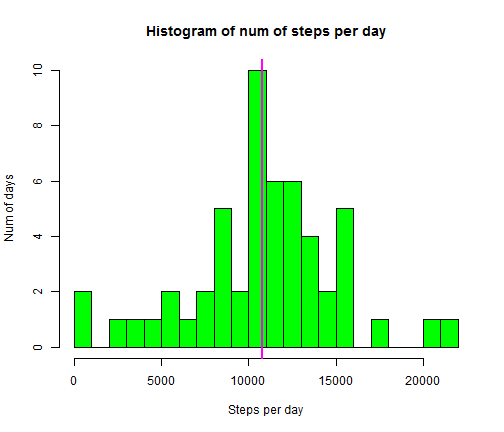
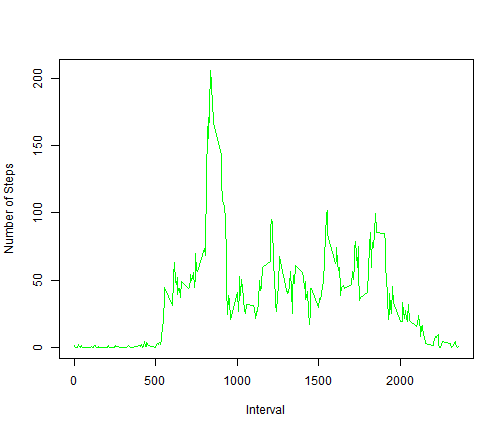
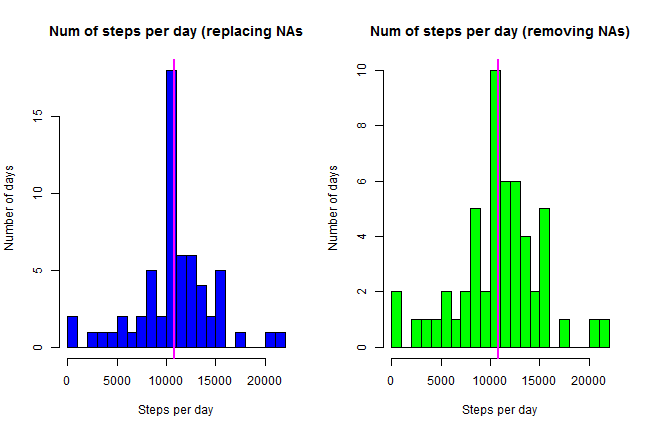
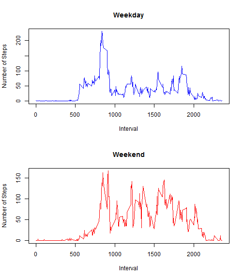

Peer Assesment 1 - Reproducible Research
========================================================

Get data
---------

```r
library("dplyr")
```

```
## Warning: package 'dplyr' was built under R version 3.1.1
```

```
## 
## Attaching package: 'dplyr'
## 
## The following objects are masked from 'package:stats':
## 
##     filter, lag
## 
## The following objects are masked from 'package:base':
## 
##     intersect, setdiff, setequal, union
```

```r
setwd("D:/Repositories/RepData_PeerAssessment1/activity/")
activity <- read.csv("activity.csv")
summary(activity)
```

```
##      steps               date          interval   
##  Min.   :  0.0   2012-10-01:  288   Min.   :   0  
##  1st Qu.:  0.0   2012-10-02:  288   1st Qu.: 589  
##  Median :  0.0   2012-10-03:  288   Median :1178  
##  Mean   : 37.4   2012-10-04:  288   Mean   :1178  
##  3rd Qu.: 12.0   2012-10-05:  288   3rd Qu.:1766  
##  Max.   :806.0   2012-10-06:  288   Max.   :2355  
##  NA's   :2304    (Other)   :15840
```

Prepare data
------------

```r
# Getting hours
hours <- activity$interval %/% 100

# Getting minutes
minutes <- activity$interval %% 100

# Set date time
date_time <- strptime(paste(as.character(activity$date),as.character(hours),":",as.character(minutes)),"%Y-%m-%d %H : %M")

activity$date_time <- date_time
str(activity)
```

```
## 'data.frame':	17568 obs. of  4 variables:
##  $ steps    : int  NA NA NA NA NA NA NA NA NA NA ...
##  $ date     : Factor w/ 61 levels "2012-10-01","2012-10-02",..: 1 1 1 1 1 1 1 1 1 1 ...
##  $ interval : int  0 5 10 15 20 25 30 35 40 45 ...
##  $ date_time: POSIXlt, format: "2012-10-01 00:00:00" "2012-10-01 00:05:00" ...
```

```r
# Tidy data. Remove NA values
activity_tidy <- na.omit(activity)
str(activity_tidy)
```

```
## 'data.frame':	15264 obs. of  4 variables:
##  $ steps    : int  0 0 0 0 0 0 0 0 0 0 ...
##  $ date     : Factor w/ 61 levels "2012-10-01","2012-10-02",..: 2 2 2 2 2 2 2 2 2 2 ...
##  $ interval : int  0 5 10 15 20 25 30 35 40 45 ...
##  $ date_time: POSIXlt, format: "2012-10-02 00:00:00" "2012-10-02 00:05:00" ...
##  - attr(*, "na.action")=Class 'omit'  Named int [1:2304] 1 2 3 4 5 6 7 8 9 10 ...
##   .. ..- attr(*, "names")= chr [1:2304] "1" "2" "3" "4" ...
```

```r
# Create dplyr table
activity_tidy_tb <- tbl_df(activity_tidy)
```

Steps mean per day
------------------

```r
activity_tidy_tb_gr <- group_by(select(activity_tidy_tb,steps,date), date)
act_per_day <- summarise(activity_tidy_tb_gr,sum(steps))
names(act_per_day) <- c("date","sum_steps")

hist(act_per_day$sum_steps, breaks=20, col="green", main="Histogram of num of steps per day", xlab="Steps per day", ylab="Num of days")

mean_steps_per_day <- as.integer(mean(act_per_day$sum_steps))
median_steps_per_day <- as.integer(median(act_per_day$sum_steps))

abline(v = mean_steps_per_day, col = "orange", lwd = 2)
abline(v = median_steps_per_day, col = "magenta", lwd = 2)
```

 

**Steps per day NA removed (mean): 10766**

**Steps per day NA removed (median): 10765**


Average daily activity pattern
------------------------------

```r
activity_tidy_tb_interval_gr <- group_by(select(activity_tidy_tb,steps,interval),interval)
act_per_interval <- summarise(activity_tidy_tb_interval_gr,mean(steps))
names(act_per_interval) <- c("interval","avg_steps")

max_interval_tidy <- act_per_interval[act_per_interval$avg_steps == max(act_per_interval$avg_steps),"interval"]

with(act_per_interval, plot(interval, avg_steps, type = "l", xlab="Interval", ylab="Number of Steps", col="green"))
```

 

**Interval with maximum number of steps (mean): 835**

Inputing missing values
-----------------------


**Total number of rows with missing values: 2304 from 17568 total rows**


```r
# Function to replace NA by interval mean
inter_mean <- function(df_activity) {
  # xbar <- mean(x[, "steps"], na.rm = TRUE)
  mean_by_interval <- mean(df_activity$steps, na.rm = TRUE)
  na_list <- is.na(df_activity[, "steps"])
  df_activity[, "steps"][na_list] <- mean_by_interval 
  df_activity
}

split_activity <- split(activity, f = activity$interval)

replace_activity <- do.call(rbind, lapply(split_activity, inter_mean))

str(replace_activity)
```

```
## 'data.frame':	17568 obs. of  4 variables:
##  $ steps    : num  1.72 0 0 47 0 ...
##  $ date     : Factor w/ 61 levels "2012-10-01","2012-10-02",..: 1 2 3 4 5 6 7 8 9 10 ...
##  $ interval : int  0 0 0 0 0 0 0 0 0 0 ...
##  $ date_time: POSIXlt, format: "2012-10-01 00:00:00" "2012-10-02 00:00:00" ...
```


```r
replace_activity_tb_gr <- group_by(select(replace_activity,steps,date), date)
rep_act_per_day <- summarise(replace_activity_tb_gr,sum(steps))
names(rep_act_per_day) <- c("date","sum_steps")

par(mfrow=c(1,2))
hist(rep_act_per_day$sum_steps, breaks=20, col="blue", main="Num of steps per day (replacing NAs", xlab="Steps per day", ylab="Number of days")

mean_steps_replace <- as.integer(mean(rep_act_per_day$sum_steps))
median_steps_replace <- as.integer(median(rep_act_per_day$sum_steps))

abline(v = mean_steps_replace, col = "orange", lwd = 2)
abline(v = median_steps_replace, col = "magenta", lwd = 2)

hist(act_per_day$sum_steps, breaks=20, col="green", main="Num of steps per day (removing NAs)", xlab="Steps per day", ylab="Number of days")

abline(v = mean_steps_per_day, col = "orange", lwd = 2)
abline(v = median_steps_per_day, col = "magenta", lwd = 2)
```

 

**Steps per day NA replaced (mean): 10766**

**Steps per day NA removed (mean): 10766**

**Steps per day NA replaced (median): 10766**

**Steps per day NA removed (median): 10765**

**Mean and median keep similar removing or replacing NAs, but distribution in histogram changes going to the median in the replacement case, it is logical because we are introducing mean values to substitute NA values** 


weekdays and weekends activity
------------------------------

```r
Sys.setlocale("LC_TIME", "English")
```

```
## [1] "English_United States.1252"
```

```r
weekends <-c("Sat","Sun")
replace_activity$day_of_week <- weekdays(replace_activity$date_time, abbreviate = TRUE)
replace_activity$type_of_day <- as.factor(ifelse(replace_activity$day_of_week %in% weekends,"weekend","weekday"))

str(replace_activity)
```

```
## 'data.frame':	17568 obs. of  6 variables:
##  $ steps      : num  1.72 0 0 47 0 ...
##  $ date       : Factor w/ 61 levels "2012-10-01","2012-10-02",..: 1 2 3 4 5 6 7 8 9 10 ...
##  $ interval   : int  0 0 0 0 0 0 0 0 0 0 ...
##  $ date_time  : POSIXlt, format: "2012-10-01 00:00:00" "2012-10-02 00:00:00" ...
##  $ day_of_week: chr  "Mon" "Tue" "Wed" "Thu" ...
##  $ type_of_day: Factor w/ 2 levels "weekday","weekend": 1 1 1 1 1 2 2 1 1 1 ...
```

```r
# Subset weekdays
replace_activity_tb_interval_weekday_gr <- group_by(filter(select(replace_activity,steps,interval,type_of_day),type_of_day == "weekday"),interval)
rep_act_per_interval_weekday <- summarise(replace_activity_tb_interval_weekday_gr,mean(steps))
names(rep_act_per_interval_weekday) <- c("interval","avg_steps")

# Subset weekends
replace_activity_tb_interval_weekend_gr <- group_by(filter(select(replace_activity,steps,interval,type_of_day),type_of_day == "weekend"),interval)
rep_act_per_interval_weekend <- summarise(replace_activity_tb_interval_weekend_gr,mean(steps))
names(rep_act_per_interval_weekend) <- c("interval","avg_steps")

# Double graph with weekday and weekend
par(mfrow=c(2,1))

with(rep_act_per_interval_weekday, plot(interval, avg_steps, type = "l", xlab="Interval", ylab="Number of Steps", main="Weekday", col="blue"))

with(rep_act_per_interval_weekend, plot(interval, avg_steps, type = "l", xlab="Interval", ylab="Number of Steps", main="Weekend", col="red"))
```

 

